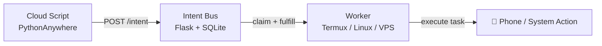

# Intent Bus

[](https://badge.fury.io/py/intent-bus)
[](https://opensource.org/licenses/MIT)

> **Run code on any device from anywhere — using just HTTP.**

A zero-infrastructure job coordination system with retries, atomic locking, priority scheduling, and cross-device workers. Built for developers who want something more reliable than cron, without the overhead of Redis, RabbitMQ, or Firebase.

📖 [Why I built this](https://dev.to/d_security/why-i-built-a-job-queue-with-sqlite-instead-of-redis-and-what-i-learned-4f05) · 📱 [Cross-device automation guide](https://dev.to/d_security/how-i-coordinate-scripts-across-devices-without-open-ports-firebase-or-a-vps-1ipi)

---

## What makes this different?

- Trigger your **Android phone from a cloud server**
- Run jobs across devices **without opening ports**
- Build distributed systems using **just HTTP + curl**
- **Priority Queues** — high-priority intents are always claimed first
- **Capability Routing** — workers advertise what they can do; jobs require what they need
- **Dead-Letter Queue** — failed jobs are archived, not lost
- No brokers, no queues, no infrastructure to maintain

No external brokers. Just a minimal Flask + SQLite core.

---

## How it works (30 seconds)

1. A client **POSTs a job** to `/intent`
2. Workers **poll `/claim`** for matching jobs
3. One worker **atomically claims** the job (`BEGIN IMMEDIATE` + `UPDATE ... RETURNING`)
4. Worker executes and calls `/fulfill`
5. If it crashes → job is **requeued with exponential backoff** and retried up to 3 times before being archived to the **dead-letter queue**



---

## Why not just use X?

| Tool | Problem |
|------|---------|
| **Cron** | No coordination, no retries, silent failures |
| **Redis / Celery** | Requires running and maintaining a server |
| **RabbitMQ** | Heavy infra, steep learning curve |
| **Firebase** | Vendor lock-in, SDK bloat, pricing at scale |
| **Intent Bus** | ✅ Single file, deploy anywhere, zero ops |

---

## Who is this for?

- Developers running scripts across multiple machines
- People using **Termux / Android automation**
- Indie hackers avoiding infrastructure complexity
- Anyone who wants job queues without Redis or RabbitMQ

This project is designed for low-to-medium traffic workloads — hundreds to low thousands of jobs per day, with dozens of concurrent workers. At that scale SQLite is a strength: zero ops, zero config, zero cost.

---

## Authentication

Intent Bus supports two auth modes for regular clients and a separate admin auth layer.

### Standard Auth

```bash
X-API-KEY: your_key_here
```

Works with curl, bash scripts, and IoT devices. No replay protection.

### Strict Auth (Recommended for production)

- HMAC-SHA256 signed requests
- Nonce-based replay protection
- Canonical request serialization
- Handled automatically by the Python SDK

Enable globally with `BUS_REQUIRE_SIGNATURES=true`, or let clients opt in by including signature headers.

### Admin Auth

Admin endpoints (`/admin/*`) use a separate privileged credential:

- `X-Admin-Token: <BUS_ADMIN_SECRET>` header, or
- HTTP Basic auth (`admin` / `DASHBOARD_PASSWORD`)

> ⚠️ **Set `BUS_ADMIN_SECRET` separately from `BUS_SECRET` in production.** If `BUS_ADMIN_SECRET` is not configured, the server falls back to accepting `BUS_SECRET` as the admin token — convenient for local dev, risky if your main key is ever exposed.

---

## Quickstart (Python SDK)

```bash
pip install intent-bus
```

### Publish a job

```python
from intent_bus import IntentClient

client = IntentClient(api_key="your_key_here")

job = client.publish(
    goal="send_notification",
    payload={"message": "Hello from the cloud"},
    idempotency_key="task_123",  # Prevents double-execution on retry
    # visibility="public",       # Any worker in this namespace can claim it
    # priority=500,              # Higher = claimed first (0–1000, default 100)
    # delay=30.0,                # Wait 30s before becoming claimable
)

print(job["id"])
```

**Job Visibility:**
- `private` *(default)* — only workers using the same API key as the publisher can claim this job
- `public` — any authenticated worker in the same namespace can claim this job

> ⚠️ **Public jobs can be claimed by any authenticated worker in the namespace.** Do not use `visibility="public"` for sensitive workloads unless every worker on your bus is trusted.

**Priority:** Higher numbers are claimed first. Default is 100. Range is 0–1000.

### Run a worker

```python
from intent_bus import IntentClient

def handler(payload):
    print("Received:", payload["message"])
    return {"status": "delivered"}

client = IntentClient(api_key="your_key_here")
client.listen(goal="send_notification", handler=handler)
```

> ⚠️ **Workers must be idempotent.** The same job may be delivered more than once if:
> - the worker crashes mid-execution
> - the lease expires before `/fulfill` is called
> - the network drops after the server marks the job fulfilled but before the response arrives
> - the bus retries due to an ambiguous failure

**SDK repo:** [github.com/dsecurity49/Intent-Bus-sdk](https://github.com/dsecurity49/Intent-Bus-sdk)

---

## Quickstart (curl / Bash)

### Publish a job

```bash
curl -X POST https://dsecurity.pythonanywhere.com/intent \
  -H "Content-Type: application/json" \
  -H "X-API-KEY: your_key_here" \
  -d '{"goal":"send_notification","payload":{"message":"Hello"}}'
```

### Publish with priority and delay

```bash
curl -X POST https://dsecurity.pythonanywhere.com/intent \
  -H "Content-Type: application/json" \
  -H "X-API-KEY: your_key_here" \
  -d '{"goal":"send_notification","payload":{"message":"Urgent"},"priority":900,"delay":5.0}'
```

### Claim and fulfill

```bash
# Claim
curl -s -X POST "https://dsecurity.pythonanywhere.com/claim?goal=send_notification" \
  -H "X-API-KEY: your_key_here"

# Fulfill
curl -s -X POST "https://dsecurity.pythonanywhere.com/fulfill/<INTENT_ID>" \
  -H "X-API-KEY: your_key_here"
```

If a job isn't fulfilled within 60 seconds, it is automatically requeued with exponential backoff.

> **Worker polling:** After a `204 No Content` (no jobs available), workers SHOULD wait 0.5–2 seconds before polling again. Tight polling loops create unnecessary write pressure on SQLite under concurrency.

---

## Job Lifecycle

```
open ──► claimed ──► fulfilled
                │
                ▼
              open  (retry with backoff, if attempts remain)
                │
                ▼  (after max_attempts exhausted)
              dead ──► dead-letter queue
```

Dead letters can be inspected at `/admin/dead` and retried via `/admin/intents/<id>/retry`.

---

## Smart Routing

Two routing primitives that go beyond simple goal matching.

### Target a specific worker

Send a job directly to one named machine — useful when a task must run on a particular device (a phone, a GPU node, a Pi with attached hardware).

```python
client.publish(
    goal="run_backup",
    payload={"path": "/data"},
    target_worker="termux-phone-1",   # only this worker can claim it
)
```

The worker declares its ID at claim time:

```bash
curl -X POST ".../claim?goal=run_backup" \
  -H "X-API-KEY: key" \
  -H "X-Worker-ID: termux-phone-1"
```

### Require a capability

Route jobs to any worker that advertises the right capability — useful when you have a mixed fleet and only some workers can handle a given task.

```python
client.publish(
    goal="transcribe_audio",
    payload={"file": "meeting.mp3"},
    required_capability="whisper",
)

client.publish(
    goal="render_video",
    payload={"scene": "intro.blend"},
    required_capability="gpu",
)
```

Workers declare their capabilities at claim time:

```bash
curl -X POST ".../claim" \
  -H "X-API-KEY: key" \
  -H "X-Worker-Capabilities: whisper,ffmpeg,gpu"
```

Both fields can be combined. A job with `target_worker` and `required_capability` must satisfy both conditions before any worker can claim it.

---

## Example Use Cases

- Trigger a **phone notification** when a cloud scraper finishes
- Deploy to a **Raspberry Pi behind a firewall** without opening ports
- Relay alerts to **Discord** from any script
- Replace fragile cron pipelines with loosely coupled workers
- Coordinate a **heterogeneous worker fleet** using capability matching

---

## Features

- **Reliable Delivery** — jobs retried with exponential backoff up to `max_attempts`
- **Atomic Locking** — `BEGIN IMMEDIATE` prevents double-claiming under concurrency
- **Dead-Letter Queue** — exhausted jobs archived for inspection and one-click retry
- **Priority Scheduling** — higher-priority intents always claimed before lower ones
- **Namespace Isolation** — partition workloads across logical domains without separate servers
- **Worker Targeting** — route a job directly to a named worker via `target_worker`
- **Capability Matching** — require specific capabilities for specialized tasks
- **Delayed Execution** — publish now, make claimable later with `delay`
- **Result Storage** — workers store structured results; publishers poll `/result/<id>`
- **Idempotency Keys** — safe publisher retries with no duplicate jobs
- **Hybrid Visibility** — private by default, optionally open to the whole namespace
- **Rate Limiting** — 60 req/min per tester key, enforced per API key
- **Ephemeral KV Store** — `/set` and `/get` with configurable TTL
- **Lazy Cleanup** — triggered by traffic, no background thread or scheduler required
- **HMAC Signing** — optional replay-protected auth, enforceable globally
- **Admin Dashboard** — live queue stats, dead letters, key management at `/admin/dashboard`
- **Prometheus Metrics** — `/metrics` with intent counts by status and namespace

---

## Architecture Guarantees

- Jobs are **never silently lost**
- Only **one worker** can claim a job at a time
- Workers can **crash safely** — jobs are requeued after lease expiry
- Delivery is **at-least-once** — design workers to be idempotent
- Dead intents are **archived**, not deleted

---

## ⚠️ Limitations

- SQLite has **single-writer contention** under high concurrency
- Best for **hundreds to low thousands of jobs per day** with dozens of workers
- Not a replacement for Kafka or RabbitMQ at scale
- Upgrade path: swap SQLite for PostgreSQL — the change is isolated to `get_db()`

---

## Setup

### Option 1 — PythonAnywhere (Free tier)

**Requirement:** SQLite 3.35.0+ (for the atomic `RETURNING` clause)

```bash
python -c "import sqlite3; print(sqlite3.sqlite_version)"
```

```bash
git clone https://github.com/dsecurity49/Intent-Bus.git
cd Intent-Bus
pip install -r server-requirements.txt
```

Configure your WSGI file:

```python
import os

os.environ["BUS_SECRET"]                   = "your_strong_secret"
os.environ["BUS_ADMIN_SECRET"]             = "your_separate_admin_secret"
os.environ["BUS_METRICS_TOKEN"]            = "your_metrics_token"
os.environ["BUS_DB_PATH"]                  = "/home/youruser/intentbus/infrastructure.db"
os.environ["BUS_TRUST_PROXY"]              = "true"
os.environ["BUS_CLEANUP_INTERVAL_SECONDS"] = "21600"
os.environ["BUS_REQUIRE_SIGNATURES"]       = "false"
os.environ["BUS_MAINTENANCE_MODE"]         = "false"

from flask_app import app as application
```

### Option 2 — Docker

> **Production note:** Run behind nginx, Caddy, or another reverse proxy that terminates HTTPS. Set `BUS_TRUST_PROXY=true` so the app correctly reads the forwarded client IP. PythonAnywhere handles this automatically.

```bash
git clone https://github.com/dsecurity49/Intent-Bus
cd Intent-Bus
docker-compose up -d
```

Edit `docker-compose.yml` to set your secrets before running.

> **SQLite note:** The `bus_data` volume must be on local storage. NFS, EFS, or network drives cause WAL locking issues.
> If you see "read-only database" on first run: `mkdir -p bus_data && chmod 777 bus_data`

### Worker (Termux / Linux)

```bash
# Termux
pkg install jq curl

# Linux
sudo apt install jq curl
```

```bash
echo "your_key_here" > ~/.apikey
chmod 600 ~/.apikey
chmod +x worker.sh
./worker.sh
```

---

## Environment Variables

| Variable | Default | Description |
|----------|---------|-------------|
| `BUS_SECRET` | — | Main API key. **Required in production.** |
| `BUS_ADMIN_SECRET` | — | Admin token (`X-Admin-Token`). Falls back to `BUS_SECRET` if unset. |
| `DASHBOARD_PASSWORD` | — | HTTP Basic auth password for the admin dashboard. |
| `BUS_METRICS_TOKEN` | — | Bearer token for Prometheus `/metrics` scraping. |
| `BUS_DB_PATH` | `infrastructure.db` | Path to the SQLite database file. |
| `BUS_TRUST_PROXY` | `false` | Enable ProxyFix. Set `true` behind nginx, Caddy, or PythonAnywhere. |
| `BUS_ENFORCE_HTTPS` | `false` | Reject non-HTTPS requests at the application level. |
| `BUS_REQUIRE_SIGNATURES` | `false` | Require HMAC signing on all client requests. |
| `BUS_MAINTENANCE_MODE` | `false` | Block all non-admin traffic with `503`. |
| `BUS_CLEANUP_INTERVAL_SECONDS` | `21600` | Minimum seconds between automatic cleanup passes (300–86400). |

---

## API Reference

| Method | Endpoint | Auth | Description |
|--------|----------|------|-------------|
| `GET` | `/` | None | Version string |
| `GET` | `/health` | None | Health check |
| `POST` | `/intent` | API key | Publish a job |
| `POST` | `/claim` | API key | Claim a job |
| `POST` | `/extend_claim/<id>` | API key | Extend the lease on a claimed job |
| `POST` | `/fulfill/<id>` | API key | Mark a job complete, optionally store result |
| `POST` | `/fail/<id>` | API key | Fail a job (triggers retry or dead) |
| `GET` | `/result/<id>` | API key | Get stored result and full status |
| `GET` | `/status/<id>` | API key | Lightweight status check |
| `POST` | `/set/<key>` | API key | Set a KV store entry with TTL |
| `GET` | `/get/<key>` | API key | Get a KV store entry |
| `GET` | `/metrics` | Token or admin | Prometheus-format metrics |
| `GET` | `/admin/dashboard` | Admin | Live queue dashboard (HTML) |
| `POST` | `/admin/generate_key` | Admin | Create a tester key |
| `POST` | `/admin/revoke_key` | Admin | Revoke a tester key and clear its data |
| `POST` | `/admin/purge` | Admin | Purge intents (namespace-scoped or full) |
| `POST` | `/admin/cleanup` | Admin | Run cleanup manually, returns stats |
| `GET` | `/admin/intents/<id>` | Admin | Full intent detail including payload |
| `POST` | `/admin/intents/<id>/cancel` | Admin | Force intent to dead |
| `POST` | `/admin/intents/<id>/retry` | Admin | Reset dead intent to open |
| `GET` | `/admin/dead` | Admin | List dead letters |
| `GET` | `/admin/dead/<id>` | Admin | Dead letter detail with original payload |

---

## Try It Live

```
https://dsecurity.pythonanywhere.com
```

To get a tester key, open a thread in [GitHub Discussions](https://github.com/dsecurity49/Intent-Bus/discussions) or join the [Discord](https://discord.gg/bzAneAQzGX).

---

## Files

| File | Purpose |
|------|---------|
| `flask_app.py` | Core server (single file) |
| `worker.sh` | Termux notification worker |
| `logger.sh` | Logging worker |
| `server-requirements.txt` | Python dependencies |
| `Dockerfile` | Container setup |
| `docker-compose.yml` | Docker Compose deployment |
| `Examples/` | Reference workers (Discord, Python) |
| `SPEC.md` | Intent Protocol v2.0 specification |
| `SECURITY.md` | Threat model and key rotation guide |
| `WORKER_SECURITY.md` | Worker security standard |
| `CONTRIBUTING.md` | Contribution guidelines |

---

## Why I built this

I wanted to trigger scripts on my Android phone from a cloud server — without Firebase, open ports, or complex infrastructure.

So I built a tiny job bus using Flask + SQLite. It worked. Then I kept going.

---

## License

MIT
