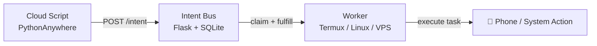

# Intent Bus

[](https://badge.fury.io/py/intent-bus)
[](https://opensource.org/licenses/MIT)

> **Run code on any device from anywhere — using just HTTP.**

A zero-infrastructure job coordination system with retries, atomic locking, priority scheduling, and cross-device workers. Built for developers who want something more reliable than cron, without the overhead of Redis, RabbitMQ, or Firebase.

📖 [Why I built this](https://dev.to/d_security/why-i-built-a-job-queue-with-sqlite-instead-of-redis-and-what-i-learned-4f05) · 📱 [Cross-device automation guide](https://dev.to/d_security/how-i-coordinate-scripts-across-devices-without-open-ports-firebase-or-a-vps-1ipi)

---

## What makes this different?

- Trigger your **Android phone from a cloud server**
- Run jobs across devices **without opening ports**
- Build distributed systems using **just HTTP + curl**
- **Hybrid Routing** — keep jobs private, or open them to any worker
- **Priority Queues** — high-priority intents are claimed first
- **Capability Routing** — workers advertise what they can handle
- No brokers, no queues, no infrastructure to maintain

No external brokers. Just a minimal Flask + SQLite core.

---

## How it works (30 seconds)

1. A client **POSTs a job** to `/intent`
2. Workers **poll `/claim`** for matching jobs
3. One worker **atomically claims** the job (`BEGIN IMMEDIATE` + `UPDATE ... RETURNING`)
4. Worker executes and calls `/fulfill`
5. If it crashes, the job is **requeued with exponential backoff** and retried up to 3 times before being archived to the **dead-letter queue**



---

## Why not just use X?

| Tool | Problem |
|---|---|
| **Cron** | No coordination, no retries, silent failures |
| **Redis / Celery** | Requires running and maintaining a server |
| **RabbitMQ** | Heavy infra, steep learning curve |
| **Firebase** | Vendor lock-in, SDK bloat, pricing at scale |
| **Intent Bus** | ✅ Single file, deploy anywhere, zero ops |

---

## Who is this for?

- Developers running scripts across multiple machines
- People using **Termux / Android automation**
- Indie hackers avoiding infrastructure complexity
- Anyone who wants job queues without Redis or RabbitMQ

This project is best suited for low-to-medium traffic workloads where simplicity matters more than horizontal scaling.

---

## Authentication

Intent Bus supports two auth modes for regular clients and a separate admin auth layer.

### Standard Auth

```bash
X-API-KEY: your_key_here
```

Works with curl, bash scripts, and IoT devices.

### Strict Auth (Recommended for production)

- HMAC-SHA256 signed requests
- Nonce-based replay protection
- Canonical request serialization
- Handled automatically by the Python SDK

Enable globally with `BUS_REQUIRE_SIGNATURES=true`, or let clients opt in by sending signature headers.

### Admin Auth

Admin endpoints (`/admin/*`) use a separate credential:

- `X-Admin-Token: <BUS_ADMIN_SECRET>` header, or
- HTTP Basic auth (`admin` / `DASHBOARD_PASSWORD`)
- If `BUS_ADMIN_SECRET` is not configured, the server MAY fall back to `BUS_SECRET`

---

## Quickstart (Python SDK)

```bash
pip install intent-bus
```

### Publish a job

```python
from intent_bus import IntentClient

client = IntentClient(api_key="your_key_here")

job = client.publish(
    goal="send_notification",
    payload={"message": "Hello from the cloud"},
    idempotency_key="task_123",  # Prevents double-execution
    # visibility="public",       # Any authenticated worker can claim this job
    # priority=500,              # Higher = claimed first (0–1000)
    # delay=30.0,                # Wait 30s before becoming claimable
)

print(job["id"])
```

> **Job Visibility:**
> - `private` *(default)* — only workers using the same API key as the publisher can claim this job
> - `public` — any authenticated worker in the same namespace can claim this job
>
> **Priority:** Higher numbers are claimed first. Default is 100. Range is 0–1000.

### Run a worker

```python
from intent_bus import IntentClient

def handler(payload):
    print("Received:", payload["message"])

client = IntentClient(api_key="your_key_here")
client.listen(goal="send_notification", handler=handler)
```

> ⚠️ Workers must be idempotent. The same job may be delivered more than once during retries, lease expiry, or network failures.

**SDK repo:** [github.com/dsecurity49/Intent-Bus-sdk](https://github.com/dsecurity49/Intent-Bus-sdk)

---

## Quickstart (curl / Bash)

### Publish a job

```bash
curl -X POST https://dsecurity.pythonanywhere.com/intent   -H "Content-Type: application/json"   -H "X-API-KEY: your_key_here"   -d '{"goal":"send_notification","payload":{"message":"Hello"}}'
```

### Publish with priority and delay

```bash
curl -X POST https://dsecurity.pythonanywhere.com/intent   -H "Content-Type: application/json"   -H "X-API-KEY: your_key_here"   -d '{"goal":"send_notification","payload":{"message":"Urgent"},"priority":900,"delay":5.0}'
```

### Claim and fulfill

```bash
# Claim
curl -s -X POST "https://dsecurity.pythonanywhere.com/claim?goal=send_notification"   -H "X-API-KEY: your_key_here"

# Fulfill
curl -s -X POST "https://dsecurity.pythonanywhere.com/fulfill/<INTENT_ID>"   -H "X-API-KEY: your_key_here"
```

### Claim with capability routing

```bash
curl -s -X POST "https://dsecurity.pythonanywhere.com/claim?goal=run_script"   -H "X-API-KEY: your_key_here"   -H "X-Worker-ID: termux-phone-1"   -H "X-Worker-Capabilities: bash,notify"
```

If a job isn't fulfilled within 60 seconds, it is automatically requeued with exponential backoff.

---

## Job Lifecycle

```text
open → claimed → fulfilled
                ↓
              open (retry with backoff)
                ↓ (after max attempts)
              dead → dead-letter queue
```

Dead letters can be inspected at `/admin/dead` and retried via `/admin/intents/<id>/retry`.

---

## Example Use Cases

- Trigger a **phone notification** when a scraper finishes
- Deploy to a **Raspberry Pi behind a firewall** without exposing ports
- Relay alerts to **Discord** from any script
- Replace fragile cron pipelines with loosely coupled workers
- Trigger automation workflows on Termux devices without SSH
- Distribute work across a **fleet of workers** with capability matching

---

## Features

- **Reliable Delivery** — jobs are retried with exponential backoff up to `max_attempts`
- **Atomic Locking** — SQLite `BEGIN IMMEDIATE` prevents race conditions
- **Dead-Letter Queue** — failed jobs are archived for inspection and manual retry
- **Priority Scheduling** — higher-priority intents are always claimed first
- **Namespace Isolation** — partition workloads without multiple servers
- **Worker Routing** — route jobs to specific workers or capability classes
- **Delayed Execution** — schedule jobs to run after a delay
- **Idempotency Keys** — prevent duplicate jobs on retry
- **Result Storage** — workers can store structured results; publishers can poll `/result/<id>`
- **Hybrid Routing** — private by default, optional public execution
- **Rate Limiting** — 60 req/min per tester key
- **Ephemeral KV Store** — `/set` and `/get` with TTL
- **Automatic Cleanup** — lazy GC prevents DB bloat
- **HMAC Signing** — optional replay-protected strict auth mode
- **Admin Dashboard** — live queue stats, dead letters, key management at `/admin/dashboard`
- **Prometheus Metrics** — `/metrics` endpoint for monitoring

---

## Architecture Guarantees

- Jobs are **never silently lost**
- Only **one worker** can claim a job at a time
- Workers can **crash safely** — jobs are requeued after lease expiry
- Delivery is **at-least-once** — workers should be idempotent
- Dead intents are **archived**, not deleted

---

## ⚠️ Limitations

- SQLite has **single-writer contention** under high load
- Best for **low to medium traffic** (scripts, bots, scrapers, notifications)
- Not a replacement for Kafka or RabbitMQ at scale
- Upgrade path: swap SQLite for PostgreSQL with minimal code changes

---

## Setup

### Option 1 — PythonAnywhere (Free tier)

**Requirement:** SQLite 3.35.0+ (for atomic `RETURNING` clause)

```bash
python -c "import sqlite3; print(sqlite3.sqlite_version)"
```

```bash
git clone https://github.com/dsecurity49/Intent-Bus.git
cd Intent-Bus
pip install -r server-requirements.txt
```

Configure your WSGI file:

```python
import os

os.environ["BUS_SECRET"] = "your_strong_secret"
os.environ["BUS_ADMIN_SECRET"] = "your_admin_secret"
os.environ["BUS_METRICS_TOKEN"] = "your_metrics_token"
os.environ["BUS_DB_PATH"] = "/home/youruser/intentbus/infrastructure.db"
os.environ["BUS_TRUST_PROXY"] = "true"
os.environ["BUS_CLEANUP_INTERVAL_SECONDS"] = "21600"
os.environ["BUS_REQUIRE_SIGNATURES"] = "false"
os.environ["BUS_MAINTENANCE_MODE"] = "false"

from flask_app import app as application
```

### Option 2 — Docker

```bash
git clone https://github.com/dsecurity49/Intent-Bus
cd Intent-Bus
docker-compose up -d
```

Edit `docker-compose.yml` to set your environment variables before running.

> **Note:** The `bus_data` volume must be on local storage. NFS, EFS, or network drives can cause SQLite WAL locking issues.
> If you get a "read-only database" error on first run: `mkdir -p bus_data && chmod 777 bus_data`

### Worker (Termux / Linux)

```bash
# Termux
pkg install jq curl

# Linux
sudo apt install jq curl
```

```bash
echo "your_key_here" > ~/.apikey
chmod 600 ~/.apikey
chmod +x worker.sh
./worker.sh
```

---

## Environment Variables

| Variable | Default | Description |
|---|---|---|
| `BUS_SECRET` | — | Main API key. **Required in production.** |
| `BUS_ADMIN_SECRET` | — | Admin token (`X-Admin-Token`). Falls back to `BUS_SECRET`. |
| `DASHBOARD_PASSWORD` | — | HTTP Basic auth password for the dashboard. |
| `BUS_METRICS_TOKEN` | — | Bearer token for `/metrics`. |
| `BUS_DB_PATH` | `infrastructure.db` | Path to the SQLite database file. |
| `BUS_TRUST_PROXY` | `false` | Enable ProxyFix (set `true` behind PythonAnywhere/nginx). |
| `BUS_ENFORCE_HTTPS` | `false` | Reject non-HTTPS requests at the app level. |
| `BUS_REQUIRE_SIGNATURES` | `false` | Require HMAC signing on all client requests. |
| `BUS_MAINTENANCE_MODE` | `false` | Block all non-admin traffic with 503. |
| `BUS_CLEANUP_INTERVAL_SECONDS` | `21600` | Seconds between automatic cleanup passes (300–86400). |

---

## API Overview

| Method | Endpoint | Description |
|---|---|---|
| `GET` | `/` | Version string |
| `GET` | `/health` | Health check |
| `POST` | `/intent` | Publish a job |
| `POST` | `/claim` | Claim a job |
| `POST` | `/extend_claim/<id>` | Extend the lease on a claimed job |
| `POST` | `/fulfill/<id>` | Mark a job complete |
| `POST` | `/fail/<id>` | Fail a job (triggers retry or dead) |
| `GET` | `/result/<id>` | Get stored result and status |
| `GET` | `/status/<id>` | Lightweight status check |
| `POST` | `/set/<key>` | Set a KV store entry |
| `GET` | `/get/<key>` | Get a KV store entry |
| `GET` | `/metrics` | Prometheus metrics |
| `GET` | `/admin/dashboard` | Admin dashboard (HTML) |
| `POST` | `/admin/generate_key` | Create a tester key |
| `POST` | `/admin/revoke_key` | Revoke a tester key |
| `POST` | `/admin/purge` | Purge intents |
| `POST` | `/admin/cleanup` | Run cleanup manually |
| `GET` | `/admin/intents/<id>` | Full intent detail |
| `POST` | `/admin/intents/<id>/cancel` | Force intent to dead |
| `POST` | `/admin/intents/<id>/retry` | Reset dead intent to open |
| `GET` | `/admin/dead` | List dead letters |
| `GET` | `/admin/dead/<id>` | Dead letter detail |

---

## Try It Live

```text
https://dsecurity.pythonanywhere.com
```

To get a tester key, open a thread in [GitHub Discussions](https://github.com/dsecurity49/Intent-Bus/discussions) or join the [Discord](https://discord.gg/bzAneAQzGX).

---

## Files

| File | Purpose |
|---|---|
| `flask_app.py` | Core server |
| `worker.sh` | Termux notification worker |
| `logger.sh` | Logging worker |
| `Dockerfile` | Docker container setup |
| `docker-compose.yml` | Docker Compose deployment |
| `Examples/` | Sample workers (Discord, Python) |
| `SPEC.md` | Intent Protocol v2.0 spec |
| `SECURITY.md` | Threat model and key rotation |
| `CONTRIBUTING.md` | Contribution guidelines |

---

## Why I built this

I wanted to trigger scripts on my Android phone from a cloud server — without Firebase, open ports, or complex infrastructure.

So I built a tiny job bus using Flask + SQLite. It worked. And became this project.

---

## License

MIT
